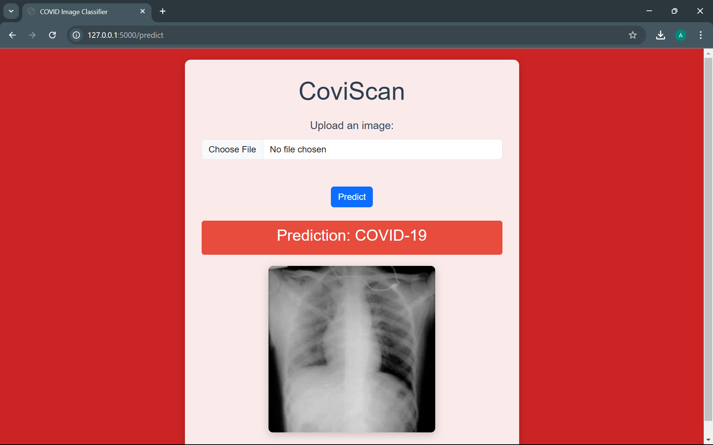
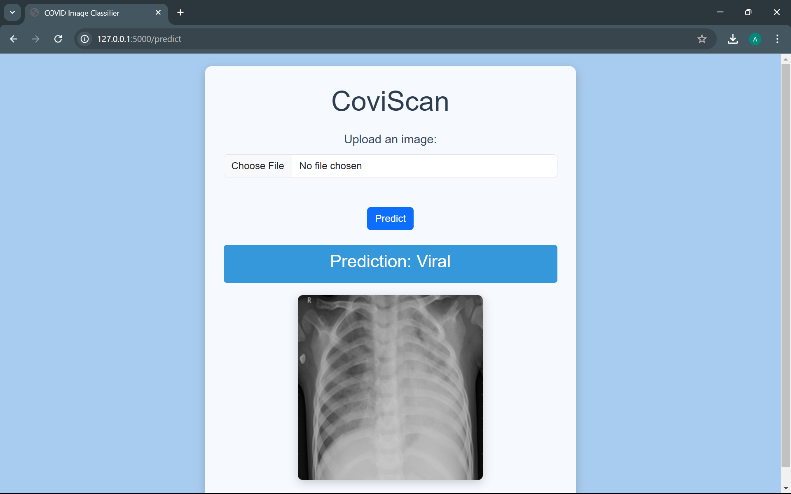
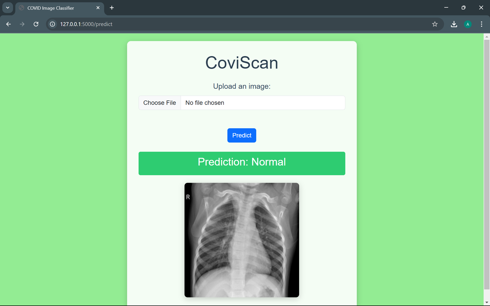

# COVID-19 Image Classifier

## Overview
This project is an AI-based diagnostic tool to predict COVID-19, Viral Pneumonia, or Normal conditions from Chest X-ray (CXR) images. Using a **Convolutional Neural Network (CNN)** trained on a labeled dataset, the system classifies an uploaded X-ray image into one of the three categories and displays the result with confidence.

---

## About the Dataset 

### Context
The whole world is suffering from COVID-19, and timely diagnosis is critical. This dataset was collected to train AI models for automating chest X-ray diagnosis. The dataset combines CXR images from different sources and research papers, creating a comprehensive dataset for the research community.

The dataset was also used in the **COVID Lite** paper, which demonstrated a CNN-based diagnostic solution with significant results.

---

### Dataset

You can download the dataset used in this project from the following link:

[Download COVID-19 Chest X-ray Dataset]([https://your-dataset-link-here](https://www.kaggle.com/datasets/sid321axn/covid-cxr-image-dataset-research))

This dataset consists of 1823 chest X-ray images categorized into three classes: **COVID-19**, **Viral Pneumonia**, and **Normal**. It contains:
- 536 images of COVID-19
- 619 images of Viral Pneumonia
- 668 images of Normal cases

The age range of COVID-19 cases in the dataset is 18-75 years.

---

## How It Works

### 1. **Upload an Image**:
- The user selects and uploads a chest X-ray image.

### 2. **Processing**:
- The uploaded image is preprocessed and passed to a **CNN Model** (`model_v1.h5`) for classification.

### 3. **Prediction**:
- The system predicts the class (COVID-19, Viral Pneumonia, or Normal) and calculates the confidence percentage.

### 4. **Display Results**:
- The result is displayed dynamically on the frontend, with a color-coded response:
    - **Red**: COVID-19 detected.
    - **Blue**: Viral Pneumonia detected.
    - **Green**: Normal case.

---

# Screenshots

### 1. **Upload Page**
.png)

### 2. **Prediction: COVID-19**

### 3. **Prediction: Viral Pneumonia**

### 4. **Prediction: Normal**

